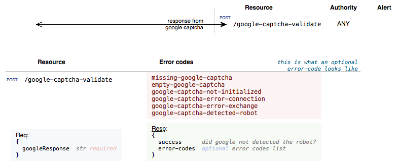

  * [Lifecycle](#lifecycle-of-dwfe-app)
  * DWFE
    * [Common](#dwfe-common)
  * Nevis module
    * [Account](#account-common)
  
# Lifecycle of DWFE App

# DWFE
## DWFE Common

# Nevis module
## Account Common

