Java10 / Spring-Boot2 / OAuth2 / MySQL / RESTful 
  

  * [Lifecycle](#lifecycle-of-dwfe-app)
  * [DWFE](#dwfe)
    * [Common](#dwfe-common)
  * [Nevis module](#nevis-module)
    * [Common](#account-common)
    * [Access](#account-access)
    * [Email](#account-email)
    * [Phone](#account-phone)
    * [Personal](#account-personal)
    * [Third-party Auth](#account-third-party-auth)
  * [Management](#management)
    * [Properties](#properties)
    * [Production Build Run](#production-build-run)
  * [Other](#other)
    * [Errors](#errors)
    * [Time Zone](#time-zone)
    * [Email alerts](#email-alerts)
  
# Lifecycle of DWFE App
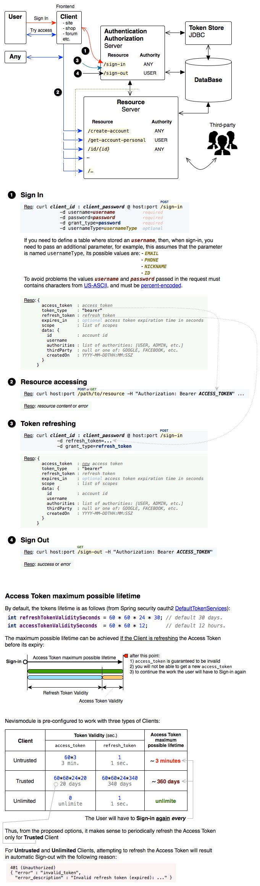

# DWFE
## DWFE Common

# Nevis module
## Account Common
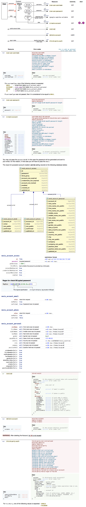
## Account Access
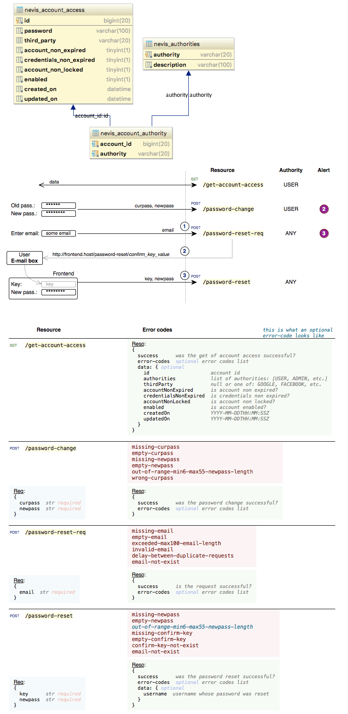
## Account Email
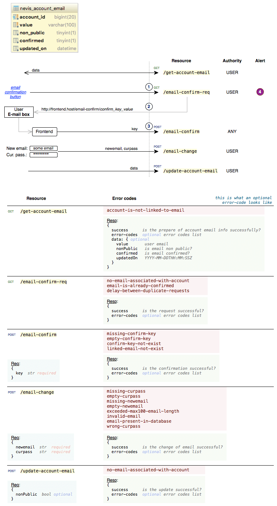
## Account Phone
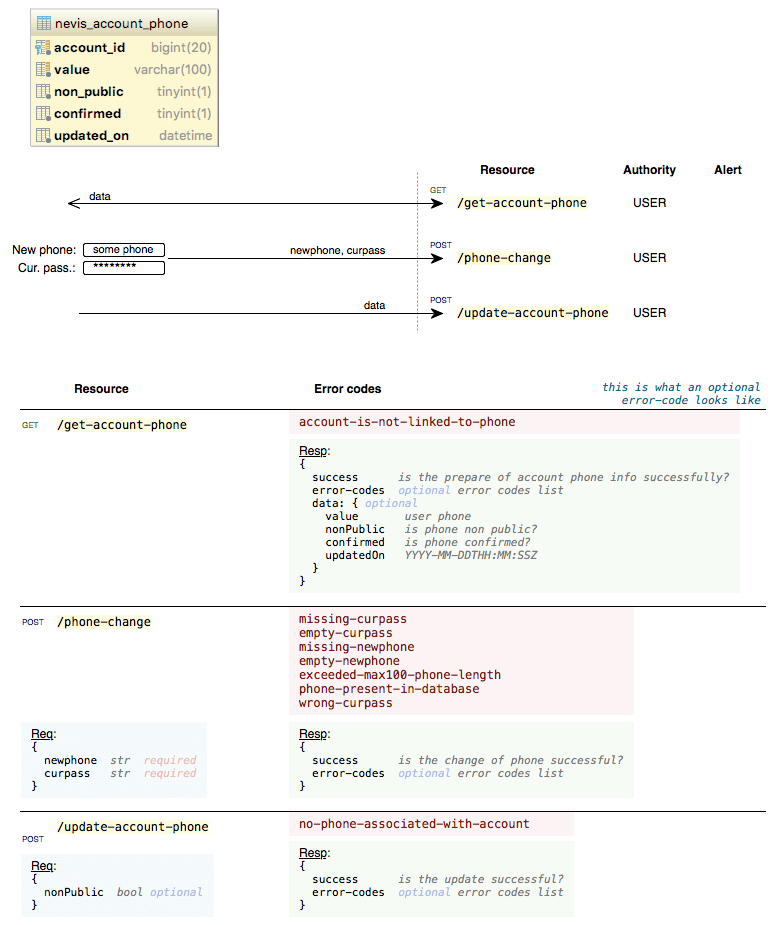
## Account Personal
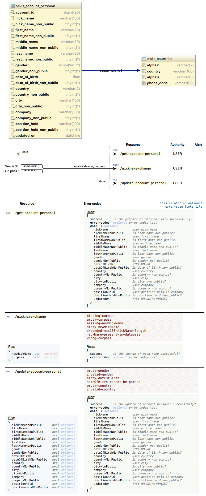
## Account Third-party Auth

# Management
## Properties
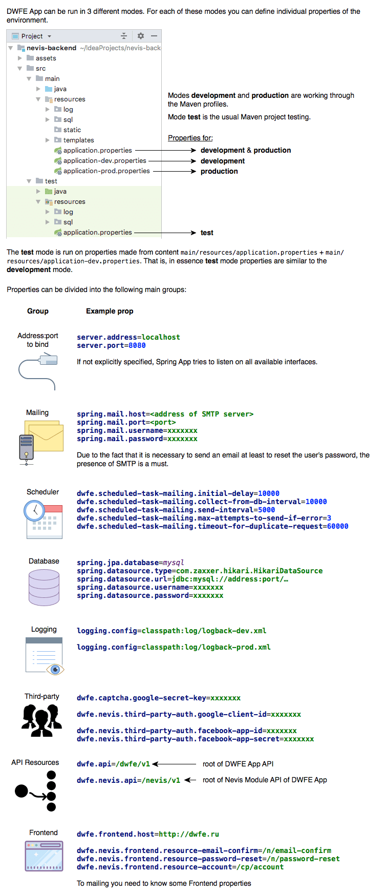
## Production Build Run
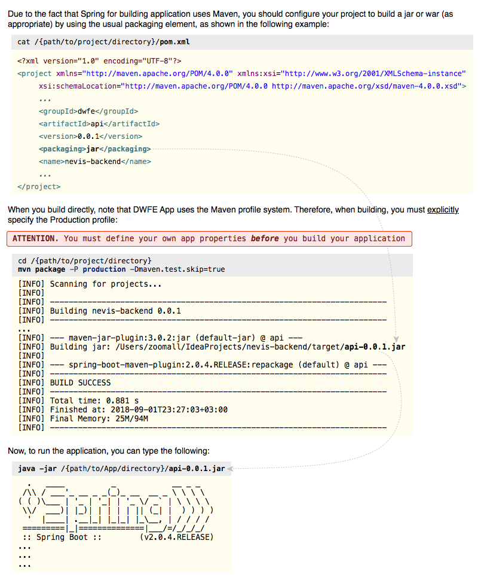

# Other
## Errors
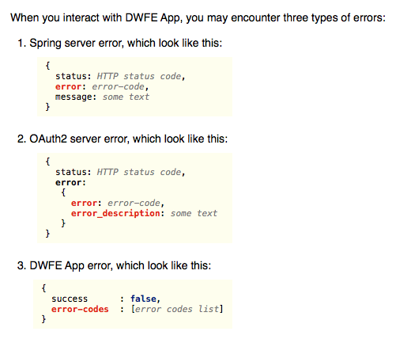
 
The list of OAuth2 server error-codes and their mapping see [here](./assets/error-mapping/oauth2-server-error-mapping.js) (may not include unknown errors to me).
 
Also you should know that under one error-code, there may be several different error_description.
 
For example `invalid_grant` error-code can be returned with the following error_descriptions: 
   * *Bad credentials* - if login or/and password is incorrect
   * *User is disabled* - if enabled field set to false
   * *User account is locked* - if account_non_locked field set to false
   * *User credentials have expired* - if credentials_non_expired field set to false
   * *User account has expired* - if account_non_expired field set to false
  
In this regard, it may be worthwhile instead of mapping error-codes to output error_description.
  
Also the list of DWFE App error-codes and their mapping see [here](./assets/error-mapping/dwfe-app-error-mapping.js).

## Time Zone
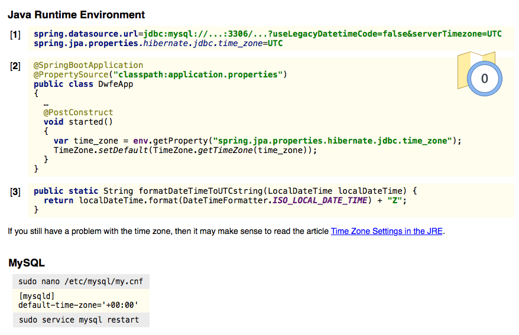
## Email alerts
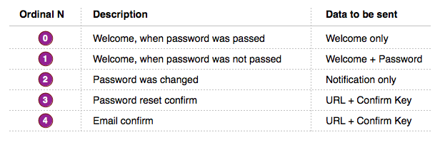
  
Preparation of mail templates was made in a separate project [backend-letter-templates](https://gitlab.com/nevis-proj/backend-letter-templates).
 
To fill the mail templates used [Thymeleaf](http://www.thymeleaf.org) template engine.

